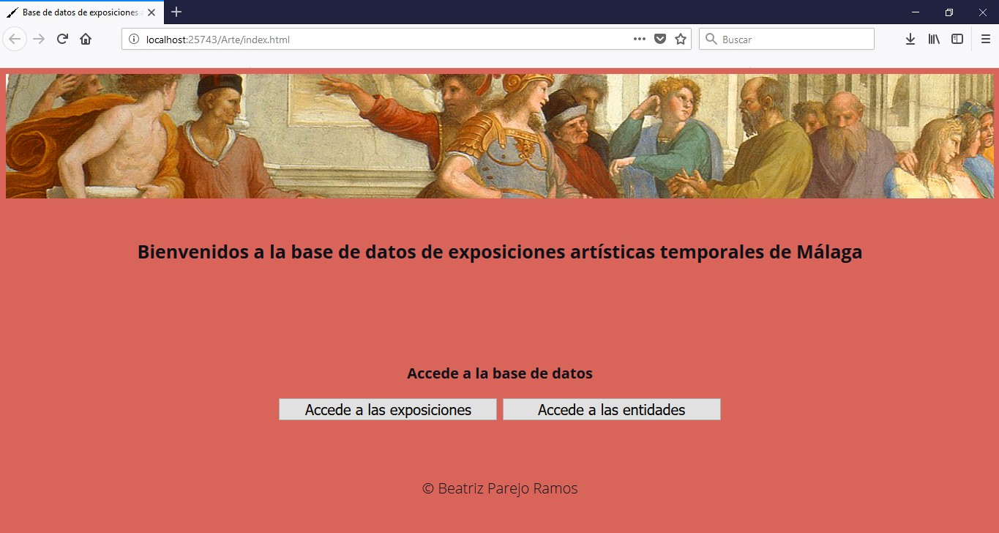
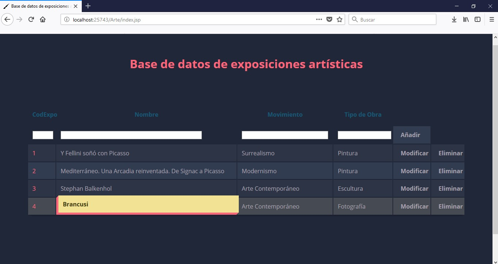
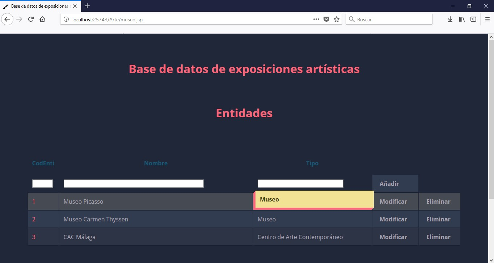
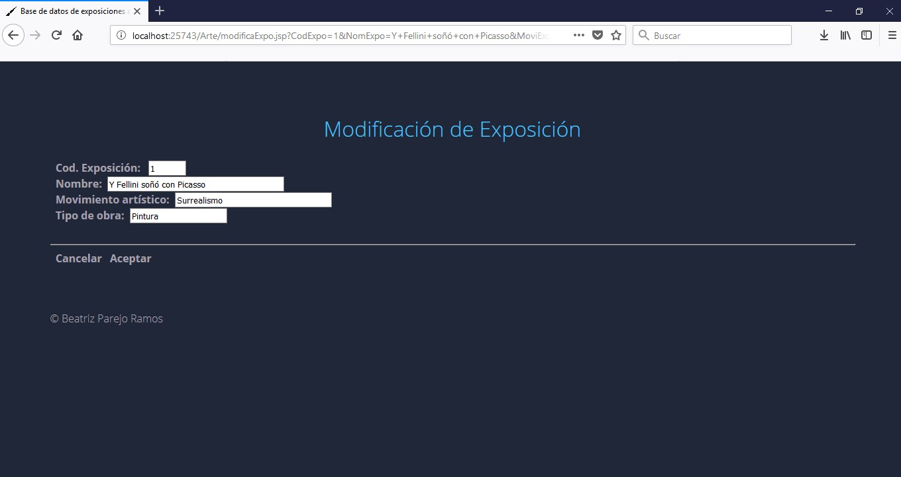
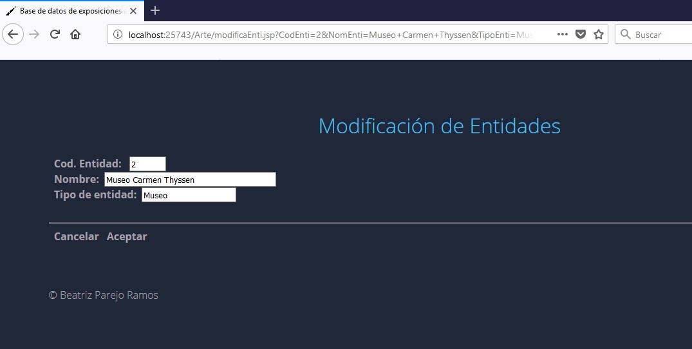
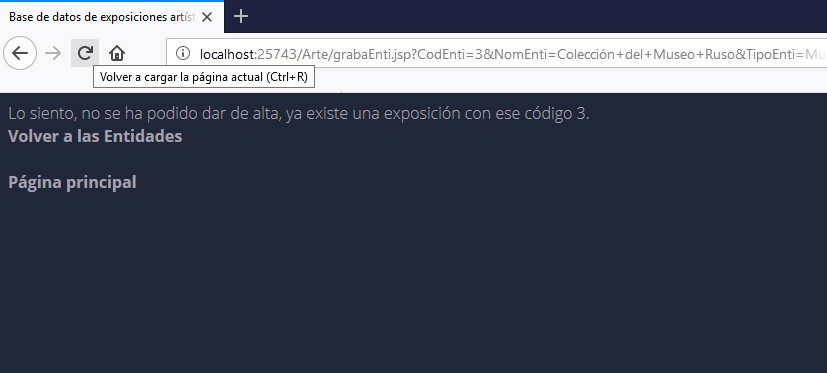

# CRUD

Mi trabajo versa sobre exposiciones temporales artísticas desarrollas en Málaga, a través de la inclusión de registros en una base de datos que realizaré con JSP y MYSQL.

El proyecto actual muestra las tablas de Exposición y de Entidad.
### Exposicion:
* CodExpo (PK)(autoincremental)
* NomExpo
* MoviExpo (Es el movimiento artístico)
* TipoObra

### Entidad:
* CodEnti (PK) (autoincremental)
* NomEnti
* TipoEnti (Museo, Galería, Casa, etc.)

## Capturas de pantalla con las distintas modificaciones que se pueden realizar

## Inicio:

[Inicio]

### Acceso:

[Acceso a las exposiciones]

[Acceso a las entidadess]

###Añadir o Crear:

[Añadir a las exposiciones]

[Añadir a las entidades]

[Exposición añadida]

[Entidad añadida]

### Modificación:

[Acceso a las exposiciones]

[Acceso a las exposiciones]

[Comprobación de que no se repita el Código (ID)]

##Estas tablas las añadiré en el futuro.

Estas son las posibles tablas que voy a utilizar en el proyecto, aunque puede que varíen e incluya algunas tablas más y del mismo modo algunos registros más, a parte de los introducidos ahora.

## Tablas:

### Exposicion:
* CodExpo (PK)(autoincremental)
* NomExpo
* MoviExpo (Es el movimiento artístico)
* TipoObra

### Entidad:
* CodEnti (PK) (autoincremental)
* NomEnti
* TipoEnti (Museo, Galería, Casa, etc.)

### Persona:
* CodPer (PK) (autoincremental)
* NomPer
* ApePer
* Sexo
* Titulacion
* TipoPer (Artista o comisario - persona que organiza la exposición artística)

Tablas que surgen:

### ExpoEnti:
* CodExpoEnti (PK)
* CodExpo (FK)
* CodEnti (FK)

### ExpoPer:
* CodExpoPer (PK)
* CodExpo (FK)
* CodPer (FK)
